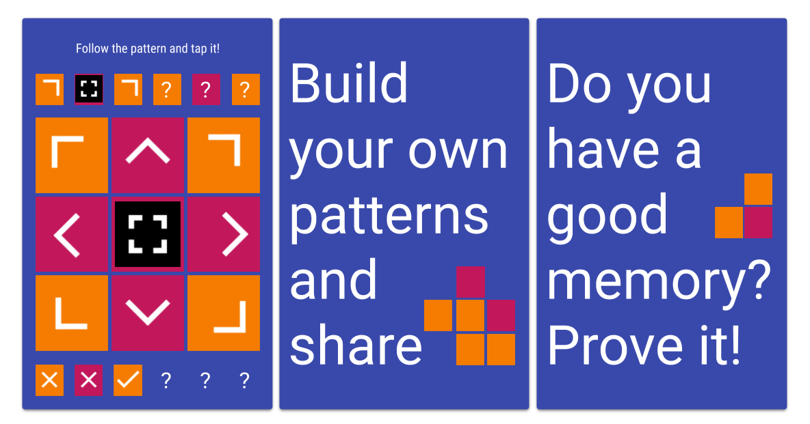
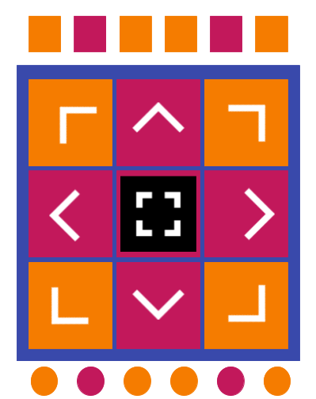

# blocks
Tap all blocks on time and win the challenge.

## design

## how it works
We have a visual map with 9 posibilities. Each challenge is fully solved by tapping the six blocks of the sequence before the timeline (6 seconnds).

## configuration

Add or remove levels using the `assets/L.txt` file by simply changin the 6 digits block.

To change messages text review `assets/M.txt` file.

## features
* Timer
* Incremental challenge
* Kind data switch

## TODO List
* [ ] Add sounds on tap, win or end.
* [ ] Add replay on levels.
* [ ] Hide block sequence in the game stage.
* [ ] Allow random mode (probably with combinations)
* [ ] Challenge others with your own pattern.

## view shorcuts
* S: Welcome Screen
* R: Results
* G: Game
* E: Game over or End

## type shorcuts
* N: Numbers
* F: Figures
* C: Characters
